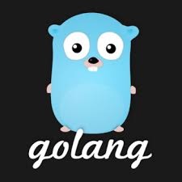
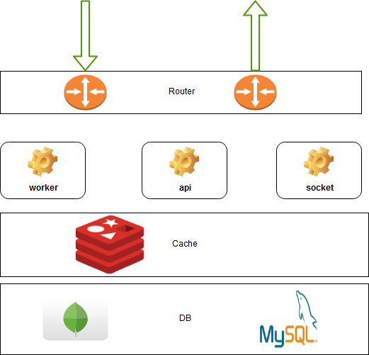

# Api Gateway: Try a new way by golang

It`s build by golang and go-gin. we hope privode a good solution to you. 

<a href="https://golang.org/">golang</a>

<a href="https://gin-gonic.github.io/gin/">go-gin</a>

<h1>Design</h1>

<h2>How to running?</h2>

1. Prepare

    <pre>
        start mongo db in your localhost, and update your mongodb info in /conf/app.conf.yml.
        You also can choise mysqldb.
    </pre>

2. Startup

    <pre>
    cd ${workdir}/apigateway
    mkdir -p logs
    go get
    go build server.go
    go run server.go
    </pre>

If running normally, you can access<a href="http://localhost:8012">http://localhost:8012</a>

<small>Keep update to here for latest changed. Thanks for you love it.</small>

